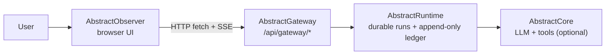

# AbstractObserver

Gateway-only observability UI (Web/PWA) for AbstractFramework runs.

What it does (implemented in `src/ui/app.tsx` + `src/lib/gateway_client.ts`):
- **Discover** workflows/bundles exposed by an AbstractGateway
- **Launch** runs, or create **automations** that the gateway runs on a schedule (durable)
- **Observe** runs and subruns by replaying + streaming the durable **ledger** (replay-first + SSE)
- **Inspect runtime state** across active runs, generated artifacts, provider calls, and gateway audit logs
- **Control** runs via durable commands (`pause`, `resume`, `cancel`)
- (Optional) **Voice** in run chat: gateway-based TTS + push-to-talk transcription (`src/ui/use_gateway_voice.ts`)

## Watching entities (the entity app)

The **entity app** (memory graph + visits UI) is its own package,
[AbstractEntity](https://github.com/lpalbou/AbstractEntity)
(`npx @abstractframework/entity`, default port `3007`). The observer still
*watches* entities — the Board's entities strip reads
`GET /api/gateway/entities` + `/entities/{name}/card` — and its
"Entities ↗" links point at the entity app deployment
(`--entity-app-url`, default `http://127.0.0.1:3007`).

## Where it fits (AbstractFramework ecosystem)
AbstractObserver is one of the browser UIs in the **AbstractFramework** ecosystem:
- AbstractFramework (ecosystem entrypoint): https://github.com/lpalbou/AbstractFramework
- AbstractRuntime (durable runtime + ledger behind the gateway): https://github.com/lpalbou/abstractruntime
- AbstractCore (LLM + tools integration used by runtime/workflows): https://github.com/lpalbou/abstractcore



## Quickstart (npm)
Prereqs:
- Node.js `>=18`
- An AbstractGateway that exposes the endpoints listed in `docs/api.md`

Run the UI server:
```bash
npx --yes --package @abstractframework/observer -- abstractobserver
```

Note: the npm package is `@abstractframework/observer`, and the CLI binary is `abstractobserver`.

Open `http://localhost:3001`. Sign-in is the shared AbstractFramework
connection dialog (the same one AbstractFlow and the gateway console use):
it opens automatically when this browser has no gateway session — enter the
gateway URL (pre-filled from the server), a Gateway user id, and that
user's token. The dialog is always one click away on the header connection
badge.

In hosted mode, Observer exchanges the user token for an app-scoped Gateway
browser session and does not persist the token in browser settings. Direct
bearer-token mode remains available for local development. When Observer is
served from a non-local hostname, the server-configured Gateway URL is
authoritative; browser-supplied Gateway URL changes are rejected unless
`ABSTRACTOBSERVER_ALLOW_REMOTE_BROWSER_GATEWAY_CONFIG=1` is set behind your own
access control. If a reverse proxy rewrites `Host`, set
`ABSTRACTOBSERVER_TRUST_PROXY_HEADERS=1` only when the proxy strips
client-supplied forwarded headers.

## Install options
### Global install
```bash
npm install -g @abstractframework/observer
abstractobserver
```

### Pin a version (recommended for deployments)
```bash
npx --yes --package @abstractframework/observer@0.1.14 -- abstractobserver
```

### CLI configuration
The CLI (`bin/cli.js`) serves the built UI and mounts the app-origin Gateway
session proxy from `@abstractframework/app-server` (a runtime dependency of
this package, installed automatically).
- `--gateway-url <url>` (aliases `--gateway`, `--url`) — the Gateway this server
  signs in to and proxies `/api` to. Default: the gateway installed on this
  computer (`~/.abstractframework/gateway.json`, followed when it moves port),
  else `http://127.0.0.1:8080`.
- `--port <n>` (default `3001`) and `--host <addr>` (default `127.0.0.1`)
- `--monitor-gpu` — the optional GPU widget
- `--entity-app-url <url>` — where the entity app lives (the "Entities ↗" links)
- `--gateway-dir <dir>` — base for relative run workspace paths (local folder reveal)

Environment variables are legacy aliases below the flags: `PORT`, `HOST`,
`ABSTRACTOBSERVER_GATEWAY_URL`, `ABSTRACTGATEWAY_URL`,
`ABSTRACTOBSERVER_MONITOR_GPU`, `ABSTRACTOBSERVER_ENTITY_APP_URL`,
`ABSTRACTOBSERVER_GATEWAY_DIR`.

The gateway can also serve the Observer through itself at `/apps/observer/`
(one port and one address for the console, the API and the apps, e.g. on a
remote server): the gateway starts this server on `127.0.0.1` and relays to
it. `abstractobserver --help` lists the flags.

See `docs/configuration.md` for the full list.

## Features (UI pages)
All pages share the same gateway connection settings.

- **Board** (Mission Control, the landing page): kanban columns Pending / Working / Review / Done across every run — cards move themselves by state; the Review column carries inline Approve/Deny/Answer; an entities strip shows each entity's phase and links into the entity app; run lists poll live (5s visible / 30s hidden)
- **Observe**: workflow/subworkflow navigator, overview, human timeline, raw ledger, provider calls, graph, digest, attachments, chat (optional voice: PTT + TTS)
- **System** (the Runtime view): Activity, Artifacts, Memory, and Logs modes for platform-level monitoring. The Artifact Explorer uses Gateway artifact envelopes and exact stats, separates Voice/Music/Sound/unclassified audio from render kinds such as Markdown/HTML/JSON, previews media inline, and links artifacts back to producing runs, ledgers, and trace/audit actions when metadata is available
- **Launch**: Run once, or Automate (what, when in UTC intervals, independent or growing context, tool approval); bundle upload/reload
- **Automations**: every automation of the signed-in user, with pause/resume/run now (also while paused)/stop current/revise/archive, its runs read as a conversation, answers to waiting runs by kind (question, tool approval, event), its folder browsable from the browser (open or download through the gateway), and Discuss (a chat, on the same page, with a fork at an occurrence: its full history, its own workspace and the automation's files read-only); legacy schedules keep their controls and can be recreated as automations (`docs/automations.md`)
- **System → Memory**: knowledge-graph (active memory) query UI (requires `POST /api/gateway/kg/query`)
- **Settings**: connection status, theme and display preferences, optional remote tool worker
- **About** (the info button in the top bar): the AbstractObserver version, links to its website, source, documentation and issue tracker, and the versions the connected gateway reports

## Documentation
- Start here: `docs/getting-started.md`
- Docs index: `docs/README.md`
- FAQ: `docs/faq.md`
- Architecture (with diagrams): `docs/architecture.md`
- Configuration & deployment: `docs/configuration.md`
- API (gateway endpoints used): `docs/api.md`
- Automations (create, manage, answer, discuss): `docs/automations.md`
- Troubleshooting: `docs/troubleshooting.md`
- Development: `docs/development.md`
- Security & trust boundaries: `docs/security.md`

## Project
- Changelog: `CHANGELOG.md`
- Contributing: `CONTRIBUTING.md`
- Security policy (vulnerability reporting): `SECURITY.md`
- Acknowledgments: `ACKNOWLEDGMENTS.md`
- Code of conduct: `CODE_OF_CONDUCT.md`

## Development (from source)
```bash
npm install
npm run dev
```

Important: dev/build expects sibling “AbstractUIC” source packages because `vite.config.ts` aliases imports to `../abstractuic/*/src`.
See `docs/development.md` for details.
