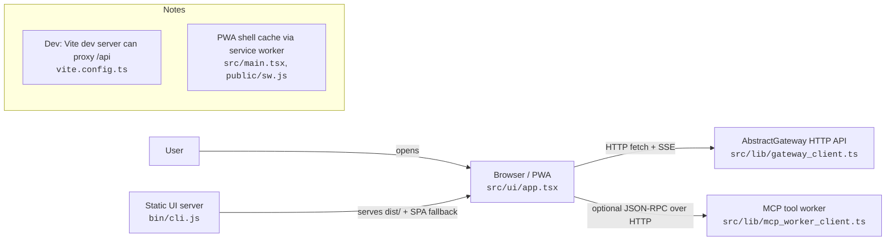
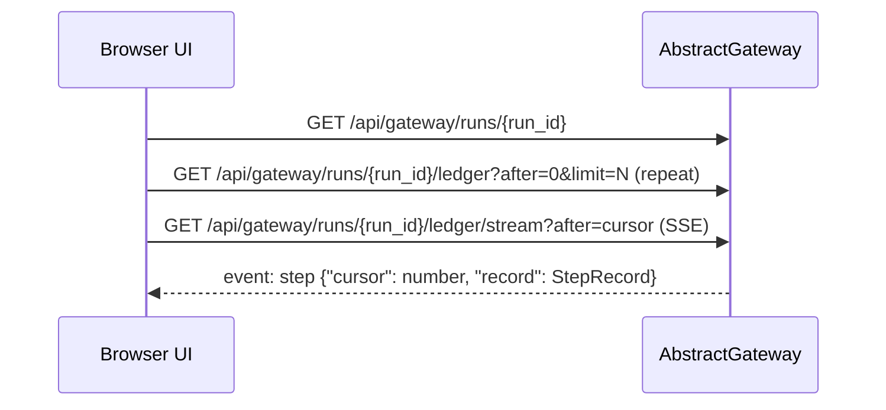

# AbstractObserver — Architecture

> Last updated: 2026-02-04

AbstractObserver is a **gateway-only** UI:
- It **does not execute** workflows.
- It renders state by fetching + streaming a **durable run ledger** from an AbstractGateway.
- It can submit **durable commands** back to the gateway.

The implementation is intentionally simple: a static SPA + typed HTTP client.

## Component view (what runs where)

## Core data flow: observe a run (replay → stream)
The UI is **replay-first**:
1) page through ledger history; then
2) open an SSE stream and append new records.

**Evidence in code**
- Replay: `GatewayClient.get_ledger()` in `src/lib/gateway_client.ts`
- Stream: `GatewayClient.stream_ledger()` + `SseParser` in `src/lib/gateway_client.ts` and `src/lib/sse_parser.ts`
- Ledger record shape: `StepRecord` / `LedgerStreamEvent` in `src/lib/types.ts`
- Minimal record interpretation helpers: `src/lib/runtime_extractors.ts`

## UI structure (pages → code)
AbstractObserver is a single SPA that stores settings locally and talks to the gateway via `GatewayClient`.

- **Observe** (runs, ledger, graph, digest, attachments, chat): `src/ui/app.tsx`, `src/ui/flow_graph.tsx`, `src/ui/run_picker.tsx`
- **Launch** (start + schedule runs, bundle upload/reload): `src/ui/app.tsx` + `GatewayClient.start_run()` / `schedule_run()`
- **Mindmap** (KG query UI): `src/ui/mindmap_panel.tsx` + `GatewayClient.kg_query()`
- **Backlog** (browse/edit/execute maintenance items): `src/ui/backlog_browser.tsx` + `GatewayClient.backlog_*()`
- **Inbox** (bug/feature reports + triage decisions + email mailbox): `src/ui/report_inbox.tsx` + `src/ui/email_inbox.tsx` + `GatewayClient.list_*_reports()` / `triage_*()` / `email_*()`
- **Processes** (process manager; high trust): `src/ui/processes_page.tsx` + `GatewayClient.list_processes()` / `process_log_tail()` / `*_process()`

## Trust boundaries (important)
AbstractObserver can enable high-trust features depending on what your gateway exposes:
- Process manager endpoints can start/stop/redeploy processes.
- Remote tool execution can be delegated to a client-controlled MCP worker, then resumed into a run via `POST /api/gateway/commands`.

See `security.md` for operational guidance.

## Related docs
- Getting started: `getting-started.md`
- Docs index: `README.md`
- Project overview + install: `../README.md`
- API (gateway endpoints used): `api.md`
- Configuration & deployment: `configuration.md`
- Security & trust boundaries: `security.md`
