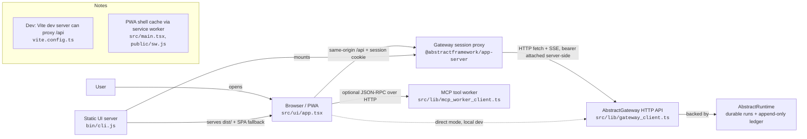
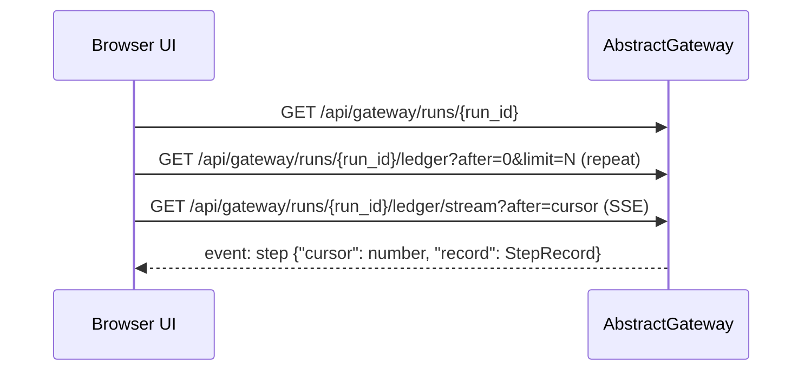

# AbstractObserver — Architecture

> Last updated: 2026-09-23

AbstractObserver is a **gateway-only** UI:
- It **does not execute** workflows.
- It renders state by fetching + streaming a **durable run ledger** from an AbstractGateway.
- It can submit **durable commands** back to the gateway.

The implementation is intentionally simple: a static SPA + typed HTTP client, served by a small Node.js CLI that also hosts the app-origin Gateway session proxy from `@abstractframework/app-server`.

## Ecosystem context (AbstractFramework)
AbstractObserver is part of the **AbstractFramework** ecosystem:
- AbstractFramework (ecosystem entrypoint): https://github.com/lpalbou/AbstractFramework
- AbstractRuntime (durable workflow runtime; produces the append-only ledger that the UI renders): https://github.com/lpalbou/abstractruntime
- AbstractCore (LLM + tools integration commonly used by runtime/workflows): https://github.com/lpalbou/abstractcore

AbstractObserver talks only to the **AbstractGateway HTTP API**. The gateway is typically backed by AbstractRuntime (and optional AbstractCore integrations), but those components are not direct dependencies of this UI package.

## Component view (what runs where)

```mermaid
flowchart LR
  U[User] -->|opens| B[Browser / PWA<br/><code>src/ui/app.tsx</code>]
  S[Static UI server<br/><code>bin/cli.js</code>] -->|serves dist/ + SPA fallback| B
  B -->|same-origin /api + session cookie| P[Gateway session proxy<br/><code>@abstractframework/app-server</code>]
  S -->|mounts| P
  P -->|HTTP fetch + SSE, bearer attached server-side| G[AbstractGateway HTTP API<br/><code>src/lib/gateway_client.ts</code>]
  B -.->|direct mode, local dev| G
  G -->|backed by| R[AbstractRuntime<br/>durable runs + append-only ledger]
  B -->|optional JSON-RPC over HTTP| W[MCP tool worker<br/><code>src/lib/mcp_worker_client.ts</code>]

  subgraph Notes[Notes]
    N1[Dev: Vite dev server can proxy /api<br/><code>vite.config.ts</code>]
    N2[PWA shell cache via service worker<br/><code>src/main.tsx</code>, <code>public/sw.js</code>]
  end
```

## Core data flow: observe a run (replay → stream)
The UI is **replay-first**:
1) page through ledger history; then
2) open an SSE stream and append new records.

```mermaid
sequenceDiagram
  participant UI as Browser UI
  participant GW as AbstractGateway

  UI->>GW: GET /api/gateway/runs/{run_id}
  UI->>GW: GET /api/gateway/runs/{run_id}/ledger?after=0&limit=N (repeat)
  UI->>GW: GET /api/gateway/runs/{run_id}/ledger/stream?after=cursor (SSE)
  GW-->>UI: event: step {"cursor": number, "record": StepRecord}
```

**Evidence in code**
- Replay: `GatewayClient.get_ledger()` in `src/lib/gateway_client.ts`
- Stream: `GatewayClient.stream_ledger()` + `SseParser` in `src/lib/gateway_client.ts` and `src/lib/sse_parser.ts`
- Ledger record shape: `StepRecord` / `LedgerStreamEvent` in `src/lib/types.ts`
- Minimal record interpretation helpers: `src/lib/runtime_extractors.ts`

## UI structure (pages → code)
AbstractObserver is a single SPA that stores settings locally and talks to the gateway via `GatewayClient`.

- **Board** (Mission Control landing page: Pending/Working/Review/Done kanban + entities strip + inline wait answers): `src/ui/mission_control.tsx` + `GatewayClient.list_entities()` / `get_entity_card()`
- **Observe** (workflow/subworkflow navigator, overview, human timeline, raw ledger, provider calls, graph, digest, attachments, chat): `src/ui/app.tsx`, `src/ui/run_panels.tsx`, `src/ui/flow_graph.tsx`
- **Runtime** (platform-level Activity, Artifacts, Memory, and Logs modes): `src/ui/runtime_page.tsx` + `GatewayClient.search_artifacts()` / `audit_log_tail()`
- **Launch** (start + schedule runs, bundle upload/reload): `src/ui/app.tsx` + `GatewayClient.start_run()` / `schedule_run()`
- **Runtime → Memory** (KG query UI): `src/ui/mindmap_panel.tsx` + `GatewayClient.kg_query()`
- **Backlog / Inbox / Processes**: Moved to the `abstractcontinuum` repo (2026-07-12 split): the observer observes and discusses; continuum develops and deploys.

## Observe projections
The raw ledger remains the authoritative record, but the default Observe experience now projects it into human-readable views:
- a run tree grouped by status, workflow, or session, with subruns nested under their parent run;
- a run overview showing start time, finish time when available, live duration, ledger volume, subrun count, provider-call count, token totals, waits, and generated summaries;
- a timeline that translates ledger records into requested work and observed outcomes;
- a provider panel derived from `llm_call` ledger effects, plus the gateway audit tail when available.

The UI intentionally keeps a raw JSON path beside every projection so investigations can verify exactly which ledger record or artifact produced a summary.

## Runtime Boundary
Runtime is resource-centered, not a workflow narrative. It surfaces global active
computation, artifact inventory, and gateway system logs. Runs and artifacts are
cross-linked when metadata contains `run_id`, but the UI does not imply artifact
provenance beyond Gateway's canonical artifact envelope.

Runtime Activity is the operational supervision view. It separates queues for
items needing attention, user responses, tool approvals, running work, failed
runs, scheduled/subworkflow waits, finished runs, and all loaded runs. Rows are
keyboard-selectable, searchable, and sortable by attention, time, duration,
token usage, and workflow. Counts in this view are scoped to the loaded run page
unless Gateway provides a broader run-stats endpoint.

Waiting rows explain the expected action before showing raw diagnostics: answer
a prompt, choose from choices, review a tool approval, wait for a schedule or
subworkflow, inspect an external event, or review the ledger when context is
unclear. The UI uses Gateway commands for run control; Gateway remains the
authorization boundary for cancel/stop/resume and wait-resolution actions.

The Artifact Explorer consumes `artifact_envelope_v1` rows from
`GET /api/gateway/artifacts/search` and requests `include_stats=true` so filter
chips and totals are exact for the selected scope instead of inferred from the
current page. It separates semantic kind (`voice`, `music`, `sound`,
unclassified `audio`) from render kind (`image`, `markdown`, `html`, `json`,
and similar display formats). The detail view prioritizes embedded preview,
creation summary, prompt/provider/media facts when recorded, run and ledger
links, provider trace/audit actions, and then raw metadata.

Artifact Explorer intentionally inventories only `Artifact` records: durable
Runtime-owned payloads exposed through Gateway envelopes. It does not claim to
inventory live `Server File` / `Server Folder` workspace paths or browser-local
`Local File` / `Local Folder` sources unless another product surface has first
materialized them into artifacts.

Gateway audit tail is labeled as global system activity and must not be
displayed as if it explains a selected artifact. Artifact-specific provider
trace and audit links are shown only when the envelope reports them.

## Trust boundaries (important)
AbstractObserver can enable high-trust features depending on what your gateway exposes:
- Remote tool execution can be delegated to a client-controlled MCP worker, then resumed into a run via `POST /api/gateway/commands`.

See `security.md` for operational guidance.

## Related docs
- Getting started: `getting-started.md`
- Docs index: `README.md`
- Project overview + install: `../README.md`
- API (gateway endpoints used): `api.md`
- Configuration & deployment: `configuration.md`
- Security & trust boundaries: `security.md`
