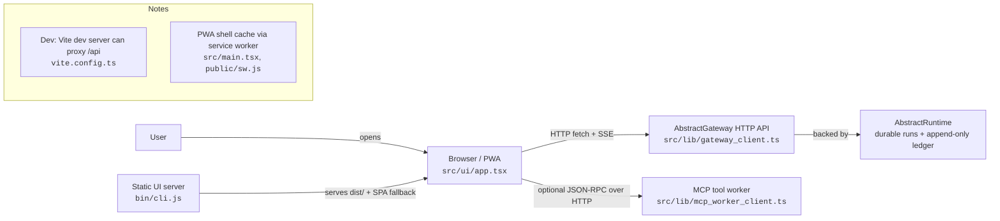
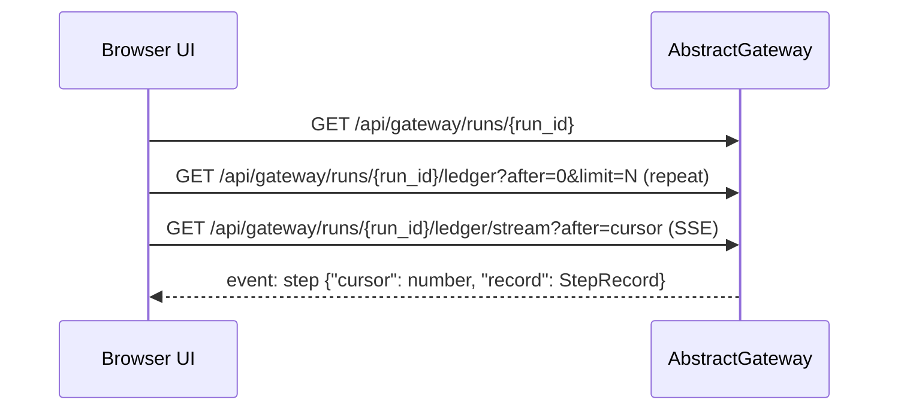

# AbstractObserver — Architecture

> Last updated: 2026-06-06

AbstractObserver is a **gateway-only** UI:
- It **does not execute** workflows.
- It renders state by fetching + streaming a **durable run ledger** from an AbstractGateway.
- It can submit **durable commands** back to the gateway.

The implementation is intentionally simple: a static SPA + typed HTTP client.

## Ecosystem context (AbstractFramework)
AbstractObserver is part of the **AbstractFramework** ecosystem:
- AbstractFramework (ecosystem entrypoint): https://github.com/lpalbou/AbstractFramework
- AbstractRuntime (durable workflow runtime; produces the append-only ledger that the UI renders): https://github.com/lpalbou/abstractruntime
- AbstractCore (LLM + tools integration commonly used by runtime/workflows): https://github.com/lpalbou/abstractcore

AbstractObserver talks only to the **AbstractGateway HTTP API**. The gateway is typically backed by AbstractRuntime (and optional AbstractCore integrations), but those components are not direct dependencies of this UI package.

## Component view (what runs where)

```mermaid
flowchart LR
  U[User] -->|opens| B[Browser / PWA<br/><code>src/ui/app.tsx</code>]
  S[Static UI server<br/><code>bin/cli.js</code>] -->|serves dist/ + SPA fallback| B
  B -->|HTTP fetch + SSE| G[AbstractGateway HTTP API<br/><code>src/lib/gateway_client.ts</code>]
  G -->|backed by| R[AbstractRuntime<br/>durable runs + append-only ledger]
  B -->|optional JSON-RPC over HTTP| W[MCP tool worker<br/><code>src/lib/mcp_worker_client.ts</code>]

  subgraph Notes[Notes]
    N1[Dev: Vite dev server can proxy /api<br/><code>vite.config.ts</code>]
    N2[PWA shell cache via service worker<br/><code>src/main.tsx</code>, <code>public/sw.js</code>]
  end
```

## Core data flow: observe a run (replay → stream)
The UI is **replay-first**:
1) page through ledger history; then
2) open an SSE stream and append new records.

```mermaid
sequenceDiagram
  participant UI as Browser UI
  participant GW as AbstractGateway

  UI->>GW: GET /api/gateway/runs/{run_id}
  UI->>GW: GET /api/gateway/runs/{run_id}/ledger?after=0&limit=N (repeat)
  UI->>GW: GET /api/gateway/runs/{run_id}/ledger/stream?after=cursor (SSE)
  GW-->>UI: event: step {"cursor": number, "record": StepRecord}
```

**Evidence in code**
- Replay: `GatewayClient.get_ledger()` in `src/lib/gateway_client.ts`
- Stream: `GatewayClient.stream_ledger()` + `SseParser` in `src/lib/gateway_client.ts` and `src/lib/sse_parser.ts`
- Ledger record shape: `StepRecord` / `LedgerStreamEvent` in `src/lib/types.ts`
- Minimal record interpretation helpers: `src/lib/runtime_extractors.ts`

## UI structure (pages → code)
AbstractObserver is a single SPA that stores settings locally and talks to the gateway via `GatewayClient`.

- **Observe** (workflow/subworkflow navigator, overview, human timeline, raw ledger, provider calls, graph, digest, attachments, chat): `src/ui/app.tsx`, `src/ui/flow_graph.tsx`, `src/ui/run_picker.tsx`
- **Runtime** (platform-level Activity, Artifacts, and Logs modes): `src/ui/app.tsx` + `GatewayClient.search_artifacts()` / `audit_log_tail()`
- **Launch** (start + schedule runs, bundle upload/reload): `src/ui/app.tsx` + `GatewayClient.start_run()` / `schedule_run()`
- **Mindmap** (KG query UI): `src/ui/mindmap_panel.tsx` + `GatewayClient.kg_query()`
- **Backlog** (browse/edit/execute maintenance items): `src/ui/backlog_browser.tsx` + `GatewayClient.backlog_*()`
- **Inbox** (bug/feature reports + triage decisions + email mailbox): `src/ui/report_inbox.tsx` + `src/ui/email_inbox.tsx` + `GatewayClient.list_*_reports()` / `triage_*()` / `email_*()`
- **Processes** (process manager; high trust): `src/ui/processes_page.tsx` + `GatewayClient.list_processes()` / `process_log_tail()` / `*_process()`

## Observe projections
The raw ledger remains the authoritative record, but the default Observe experience now projects it into human-readable views:
- a run tree grouped by status, workflow, or session, with subruns nested under their parent run;
- a run overview showing start time, finish time when available, live duration, ledger volume, subrun count, provider-call count, token totals, waits, and generated summaries;
- a timeline that translates ledger records into requested work and observed outcomes;
- a provider panel derived from `llm_call` ledger effects, plus the gateway audit tail when available.

The UI intentionally keeps a raw JSON path beside every projection so investigations can verify exactly which ledger record or artifact produced a summary.

## Runtime Boundary
Runtime is resource-centered, not a workflow narrative. It surfaces global active computation, artifact inventory, and gateway system logs. Runs and artifacts are cross-linked when metadata contains `run_id`, but the UI does not imply artifact provenance beyond the metadata it has. Gateway audit tail is labeled as global system activity and must not be displayed as if it explains a selected artifact.

## Trust boundaries (important)
AbstractObserver can enable high-trust features depending on what your gateway exposes:
- Process manager endpoints can start/stop/redeploy processes.
- Remote tool execution can be delegated to a client-controlled MCP worker, then resumed into a run via `POST /api/gateway/commands`.

See `security.md` for operational guidance.

## Related docs
- Getting started: `getting-started.md`
- Docs index: `README.md`
- Project overview + install: `../README.md`
- API (gateway endpoints used): `api.md`
- Configuration & deployment: `configuration.md`
- Security & trust boundaries: `security.md`
